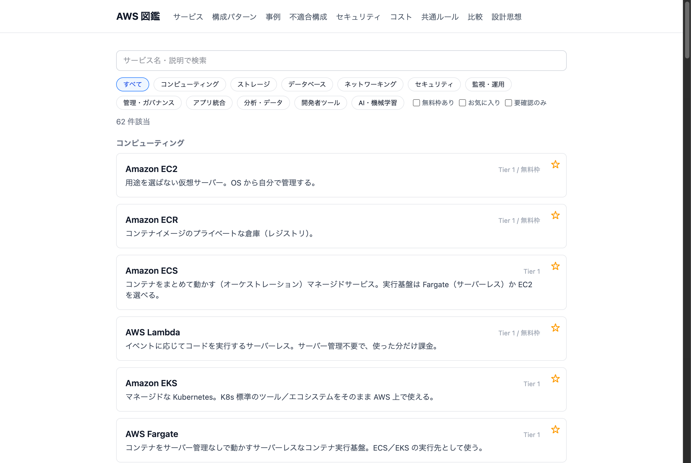
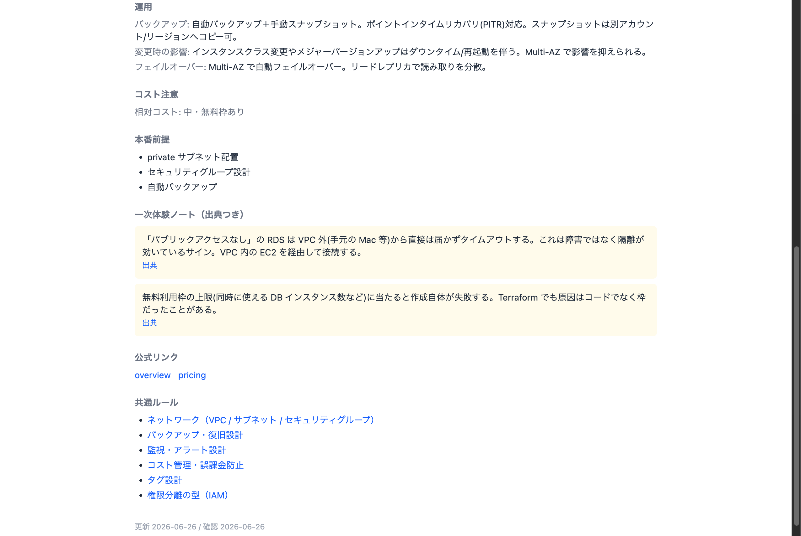

# aws-zukan — AWS 設計判断の図鑑

AWS のサービスを「部品表」として引くだけでなく、「どう組み合わせるか」「どんな構成が向く／向かないか」までを前提条件つきで引ける図鑑アプリです。

🔗 ライブデモ: https://80-cloud.github.io/aws-zukan/

---

## 解きたい課題

AWS は数百のサービスがあり、公式ドキュメントは「各サービスが何をするか」は詳しい一方、「この要件にはどの構成が妥当か」「何を見落とすと事故るか」は横断的に引きにくい。学習者や設計に不慣れな人が「動くけれど本番に足りない構成」を作ってしまいがちです。

そこで、サービス単体ではなく構成（設計判断）と横断ルールまでを一つの図鑑にまとめ、検索・比較・レビュー観点まで引けるようにしました。

## アプローチと差別化

| 差別化 | 中身 |
|---|---|
| 2 層 ＋ 横断ルールのデータモデル | サービス図鑑（部品表）／構成パターン図鑑（設計判断集）／共通ルール（ネットワーク・IAM・暗号化等を正規化し重複記述しない） |
| 断定しない | 「正解／不正解」ではなく「標準推奨構成／不適合になりやすい構成」を前提条件つきで示す |
| 8 軸で評価 | Well-Architected の 6 本柱＋独自 3 軸（統制適合・移行容易・ベンダー依存）を ◎○△ で表示 |
| 創作しない | 本文・公式を読んでから書き、体験ベースの記述は出典必須。確認できない欄は空のままにして未確認を可視化 |
| 派生ビューは文章生成に頼らない | 設計レビュー観点・セキュリティ注意・隠れコスト・事例検索・不適合構成は、既存データからルールベースで機械的に組み立て |

## 主な機能

- サービス図鑑 — カテゴリ分類・キーワード検索・絞り込み（無料枠/お気に入り/要確認）。詳細では用途／不適合な場面／随伴サービス／採用判断／運用／一次体験ノート（出典つき）／共通ルールへのリンクを表示。
- 構成パターン図鑑 — 標準推奨構成・不適合になりやすい構成・必要な統制・8 軸評価・設計レビュー観点（自動生成）。
- 事例（シナリオ）検索 — 「オンプレ移行」等の業務課題から構成を引く。
- セキュリティ注意カタログ — 公開範囲・権限・暗号化・ログ等の注意点を全データから横断集約。
- 隠れコスト辞典 — NAT・転送量・ログ量・残存課金など想定外請求になりやすい点を横断集約（具体額は持たず定性表現）。
- 共通ルール / 比較 / お気に入り — 横断ルールの正規化、構成の 8 軸比較、閲覧状態の保存。
- 不適合になりやすい構成カタログ — 各構成の「この前提では不適合になりやすい」選択をサービス単位で逆引き（前提条件つき）。
- 情報の鮮度管理 — 確認日が一定期間を過ぎた項目に「要確認」を表示し、情報の経年劣化を可視化。

## 技術スタック

- フロントエンド: React 19 / Vite 6 / TypeScript / Tailwind CSS 4 / React Router
- データ: JSON（data/）を src/api/ のリポジトリ層だけから読む隔離設計
- CI/CD: GitHub Actions（用語・命名チェック＋ GitHub Pages 自動デプロイ）

## 設計のこだわり

- データを足すだけで増える — サービス／構成を JSON に追加するだけで一覧・検索・比較に反映され、表示側のコードは書き換え不要。データ読み込みを src/api/ に隔離しているため、将来 JSON からバックエンドへ載せ替えても画面は無改修。30 件から 300 件規模まで破綻しない構造を狙う。
- 壊れにくくする — 参照（サービス id 等）は実在チェックして壊れたリンクを出さない。確認できない情報は創作せず空にする。

## ローカル開発

- 依存導入: `npm --prefix frontend install`
- 開発サーバー: `npm --prefix frontend run dev`（http://localhost:5176）
- ビルド: `npm --prefix frontend run build`（型チェック + 本番ビルド）

コミット前に用語・命名チェックが自動で走ります（初回のみ `bash scripts/install-hooks.sh`）。

## ロードマップ

- Phase 1（現在）: 読み取り図鑑 — サービス／構成パターン／共通ルールと、ルールベースの派生ビュー（設計レビュー観点・セキュリティ注意・隠れコスト・事例・不適合構成・鮮度管理）。
- Phase 2（構想）: 組織統制層 — 承認の要否・標準構成・社内標準との差分・監査証跡・アカウント配置・責任分界など、企業／グループ利用向けの統制機能。文章生成に頼らずルールベースで組み立てる方針は維持し、データ読み込みを src/api/ に隔離した現構造の上にバックエンド（Java / Spring Boot）と認可を載せる。

## ライセンス

[LICENSE](LICENSE)（MIT）を参照。
