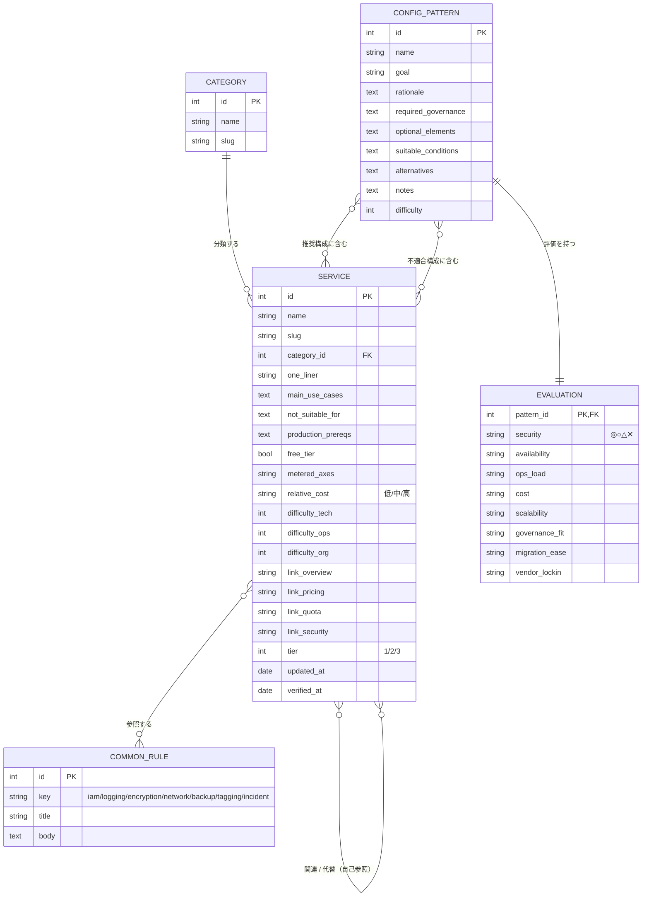

# aws-zukan データモデル（ER図）

**バージョン:** 0.1
**作成日:** 2026-06-26

最初の版はデータベースを持たず、同じ構造を JSON ＋ TypeScript 型で表す。Phase 2 で同じ構造を PostgreSQL のテーブルへ移す。

---

## エンティティ概要

| エンティティ | 役割 |
|---|---|
| Category | サービスのカテゴリ（コンピューティング・ストレージ 等） |
| Service | 個々のサービス（部品表） |
| CommonRule | 共通ルール（IAM・ログ・暗号化 等の横断ページ） |
| ConfigPattern | 構成パターン（設計判断集） |
| Evaluation | 構成パターンの8観点評価（ConfigPattern に内包） |

関連（多対多）はすべて中間テーブル／配列参照で表す。

---

## ER 図（Phase 2 の関係構造）



---

## 中間テーブル（多対多の実体）

| テーブル | 列 | 意味 |
|---|---|---|
| service_related | service_id, related_service_id | 関連サービス（自己参照） |
| service_alternative | service_id, alt_service_id | 代替候補（自己参照） |
| service_common_rule | service_id, common_rule_id | サービス→共通ルール参照 |
| pattern_recommended | pattern_id, service_id, role | 標準推奨構成に含むサービス |
| pattern_anti | pattern_id, anti_index, service_id | 不適合構成（anti_index で構成ごとに束ねる） |

---

## Phase 1 の表現（DB なし）

同じ構造を `src/data/` の JSON と `src/types/` の TypeScript 型で持つ。

```ts
type RealWorldNote = { source: string; gotcha: string };   // 一次体験のつまずき＋出典

type Service = {
  id: string; name: string; slug: string; category: string;
  oneLiner: string; mainUseCases: string[]; notSuitableFor: string[];
  productionPrereqs: string[];
  commonRuleRefs: string[];        // CommonRule.key への参照
  cost: { freeTier: boolean; meteredAxes: string[]; relative: '低'|'中'|'高' };
  related: string[]; alternatives: string[];   // Service.id
  difficulty: { tech: number; ops: number; org: number };
  links: { overview: string; pricing?: string; quota?: string; security?: string };
  tier: 1 | 2 | 3; updatedAt: string; verifiedAt: string;
  companions?: { serviceId: string; role: string }[]; // 随伴サービス候補（監視/ログ/IAM/バックアップ等＝必須補完）
  costGotcha?: string;                          // 課金が見落とされやすい点（常時課金・残存課金・隠れコスト）
  adoption?: {                  // 採用判断クラスタ（新規採用してよいかの判断材料）
    deprecationRisk?: string;   // 廃止・縮小・後継サービスの注意
    region?: { tokyo?: boolean; notes?: string };  // リージョン対応差分（東京可否・依存機能）
    quotaGotcha?: string;       // 初期上限・申請が要りやすい上限・増枠の目安
    sla?: string;               // SLA有無・単一AZで足りるか・冗長化の選択肢
    lockin?: '低' | '中' | '高'; // AWS固有依存度（移行難易度）
    modernizeTo?: string[];     // 移行先(serviceId)＝モダナイズ候補
  };
  ops?: {                       // 運用クラスタ（本番運用の実務情報）
    iacSupport?: { terraform?: boolean; cloudformation?: boolean; cdk?: boolean; cli?: boolean };
    backup?: string;            // バックアップ可否（AWS Backup/スナップショット/PITR/クロスアカウント）
    changeImpact?: string;      // 変更で止まりやすい/再作成が要る/ダウンタイム有無
    failover?: string;          // 障害時の代替手段・復旧観点
    dataResidency?: string;     // データ保管場所・越境（クロスリージョン複製等）の注意
  };
  realWorldNotes?: RealWorldNote[];            // 実際に踏んだつまずき（出典つき）
};

type Grade = '◎' | '○' | '△' | '✕';
type ConfigPattern = {
  id: string; name: string; goal: string;
  recommendedStack: string[];                      // Service.id
  antiPatterns: { stack: string[]; why: string; source?: string }[];// 不適合になりやすい構成（出典つき）
  rationale: string; requiredGovernance: string[]; optional: string[];
  suitableConditions: string[]; alternatives: string[]; notes?: string;
  difficulty: number;
  evaluation: {
    security: Grade; availability: Grade; opsLoad: Grade; cost: Grade;
    scalability: Grade; governanceFit: Grade; migrationEase: Grade; vendorLockin: Grade;
  };
  scenarioTags?: string[];                         // 事例/業務課題タグ（オンプレ移行・子会社統合・外部公開 等＝事例検索）
  stackRoles?: { serviceId: string; role: string }[]; // 構成内の各サービスの役割（依存関係グラフ用）
  realWorldNotes?: RealWorldNote[];                // 実際に踏んだつまずき（出典つき）
};

// 派生ビュー（新スキーマ不要）：
// ・設計レビュー観点チェック … requiredGovernance + commonRuleRefs + evaluation から生成
// ・セキュリティ注意カタログ … antiPatterns + common-rules + realWorldNotes から抽出
// ・組織統制層（Phase 2）… 統制チェック/責任分界/導入条件・社内申請 は別ファイル governance.json で管理（組織固有値）

type CommonRule = { key: string; title: string; body: string };
```

> `src/api/` はこの型を返す関数を公開する。Phase 1 は JSON を読むだけ、Phase 2 は同じ型のまま REST から取得する実装に差し替える（画面側は無改修）。

### realWorldNotes（実体験のつまずき）

サービス・構成パターンは、実際に踏んだ「つまずき」を出典つきで持てる。推測でなく検証済みの事実だけを載せ、図鑑の信頼性を担保する。元データは `data/services.json` / `data/patterns.json`（→ `data/README.md`）。

---

## 評価の8観点（再掲）

公式の品質の柱（運用・セキュリティ・信頼性・性能・コスト・持続可能性）に対応づけ、さらに**統制適合・移行容易・ベンダー依存度**を加える。各観点は ◎○△✕ の4段階で持ち、比較表として即描画できるようにする。
